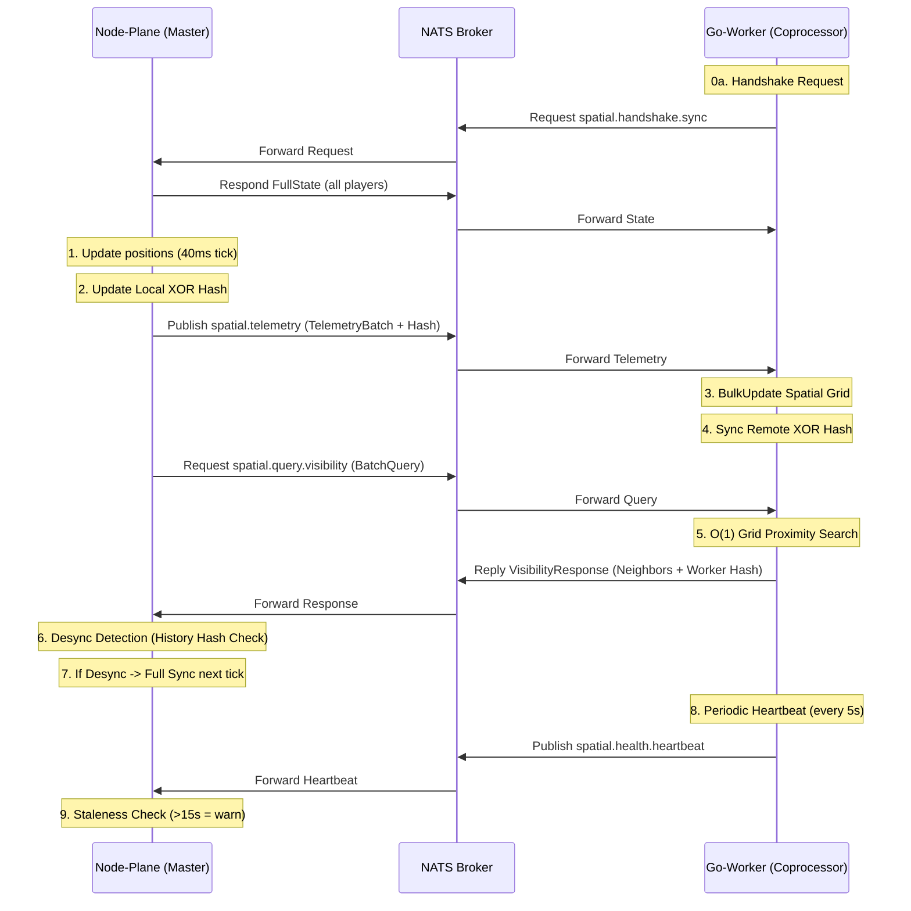

# HashGrid Spatial Engine

A high-performance distributed spatial partitioning system with incremental state synchronization between a Node.js Plane (Master) and a Go Coprocessor (Worker).

## Why This Architecture? Solving Node.js Bottlenecks

In high-load real-time applications (like MMOs or simulation engines), Node.js often faces significant performance challenges:

1.  **Single-Threaded Event Loop**: Node.js is excellent for I/O but struggles with CPU-bound tasks. Calculating visibility for 1,000+ entities every 40ms requires intensive mathematical operations (distance checks, bucket iterations). If performed on the main thread, this blocks the Event Loop, causing latency spikes and dropped ticks.
2.  **Expensive Spatial Math**: Heavy spatial partitioning logic in JavaScript often leads to high Garbage Collection (GC) pressure and unpredictable execution times.
3.  **The Solution**: By offloading the "heavy lifting" to a **Go Coprocessor**, we achieve:
    *   **True Parallelism**: Go's goroutines and `sync.RWMutex` allow multiple visibility queries to execute simultaneously across all CPU cores.
    *   **Predictable Performance**: Go provides native 32/64-bit float performance and manual control over memory (via `sync.Pool`), ensuring sub-millisecond query responses without blocking the Node.js Master.
    *   **Scalability**: The Node-Plane remains lightweight, focusing on high-level logic and I/O, while the Go-Worker scales the complex spatial math.

## System Architecture



The system consists of two main components communicating over **NATS** using **Protocol Buffers**:

1.  **Node-Plane (TypeScript/Bun)**:
    *   Acts as the **Source of Truth** for entity positions.
    *   Simulates entity movement (40ms ticks).
    *   Calculates a **Commutative XOR Hash** of the entire world state.
    *   Maintains a **Hash History** (up to 1000 entries) to mitigate network latency in desync detection.

2.  **Go-Worker (Golang)**:
    *   Acts as a **Spatial Coprocessor**.
    *   Maintains a voxel-based **Spatial Grid** for efficient proximity queries ($O(1)$ bucket access).
    *   Provides high-speed visibility calculation services.
    *   Independently tracks the state hash to ensure data integrity.
    *   Publishes periodic **heartbeats** for liveness monitoring.

## Synchronization Protocol

### 1. Commutative XOR Hashing
To ensure the Node-Plane and Go-Worker are always in sync without sending the full world state every tick, the system uses a commutative hash:
-   Each entity's state (ID + Position) is hashed using **FNV-1a (64-bit)**.
-   The global state hash is calculated as: `TotalHash = Hash(P1) ^ Hash(P2) ^ ... ^ Hash(Pn)`.
-   When an entity moves: `TotalHash = TotalHash ^ OldEntityHash ^ NewEntityHash`.
-   **Precision**: `Math.fround()` in JavaScript and `float32` in Go are used to ensure bit-identical representation of coordinates across runtimes.

### 2. Desync Detection & Mitigation
-   **Atomic Updates**: Go-Worker uses `BulkUpdate` under a single write lock to process telemetry batches, preventing "dirty reads" of the hash during query processing.
-   **Hash History**: Node-Plane maintains a sliding window of the last 1000 generated hashes.
-   **Validation**: When a Visibility Query response arrives from Go, Node-Plane checks if the returned `StateHash` exists in its history.
-   **Recovery**: If the remote hash is not found in history, a **Full Synchronization** is triggered, dumping all entity positions to the Go-Worker in the next tick.

### 3. Handshake Protocol
On startup, the Go-Worker requests a full state snapshot from the Node-Plane:
-   Worker publishes a `HandshakeRequest` on `spatial.handshake.sync` (up to 5 retries, 2s timeout).
-   Node-Plane responds with a complete `TelemetryBatch` of all current entities.
-   If the handshake fails (Node-Plane not yet ready), the worker starts with an empty grid and synchronizes incrementally.

### 4. Heartbeat / Liveness
The Go-Worker publishes a `Heartbeat` message every 5 seconds on `spatial.health.heartbeat`:
-   `timestamp_ms`: millisecond-precision timestamp for staleness calculation.
-   `batch_count`: total telemetry batches processed since start.
-   `grid_size`: current number of tracked entities.
-   Node-Plane tracks the last heartbeat timestamp and warns if >15s have elapsed without one.

### 5. Graceful Shutdown
On `SIGINT`/`SIGTERM`, both components follow a deterministic shutdown sequence:
1. **Root context cancelled** — `monitorRPS`, `StartHeartbeat`, and handshake goroutines exit.
2. **NATS connection drained** — waits for in-flight message handlers to complete.
3. **Handshake goroutine waited** — `sync.WaitGroup` ensures it's not mid-retry.
4. **TelemetryHandler shutdown** — background goroutines (RPS reporter, heartbeat) confirmed stopped.
5. Process exits cleanly — no `time.Sleep`, no goroutine leaks.

## Tech Stack

- **Transport**: [NATS](https://nats.io/) (Pub/Sub and Req/Rep)
- **Serialization**: [Protocol Buffers (v3)](https://protobuf.dev/)
- **Node-Plane**: [Bun](https://bun.sh/) (TypeScript runtime), [Vitest](https://vitest.dev/) (testing)
- **Go-Worker**: Go (v1.25+), `log/slog` for structured logging
- **Protobuf Toolchain**: [Buf](https://buf.build/) (remote code generation, v2 schema)

## Getting Started

### 1. Fast Track (Docker Compose)
The easiest way to run the entire system (NATS + Go-Worker + Node-Plane) is using Docker:
```bash
docker compose up --build
```
This will:
1.  Start the **NATS** broker.
2.  Build and run the **Go Spatial Worker**.
3.  Build and run the **Node Master Plane**.

### 2. Manual Development Setup

#### Infrastructure (NATS Only)
If you want to run services manually for debugging:
```bash
docker compose up nats -d
```

#### Go-Worker (Coprocessor)
Navigate to the `go-worker` directory and run the service:
```bash
cd go-worker
export NATS_URL=nats://localhost:4222
go run ./cmd/coprocessor/main.go
```
To run tests:
```bash
go test ./...
```

#### Node-Plane (Master)
Navigate to the `node-plane` directory, install dependencies, and start the simulation:
```bash
cd node-plane
bun install
export NATS_URL=nats://localhost:4222
bun run dev
```

## Benchmarks

Performance measured on **AMD Ryzen 5 6600H** (Go 1.25.9, 6 cores, Bun 1.3):

### Proximity Queries (`GetInRadius`)

| Scenario | Players | Radius | Time per Op | Memory / Allocations |
|----------|---------|--------|-------------|----------------------|
| **Sparse** | 100 | 50m | **380 ns** | 0 B/op (0 allocs) |
| **Sparse** | 1,000 | 50m | **450 ns** | 0 B/op (0 allocs) |
| **Sparse** | 10,000 | 50m | **2.35 µs** | 5.6 KB/op (3 allocs) |
| **Sparse** | 1,000 | 150m | **3.5 µs** | 0 B/op (0 allocs) |
| **Sparse** | 1,000 | 500m | **80 µs** | 0 B/op (0 allocs) |
| **Clustered** | 1,000 | 50m | **1.30 µs** | 0 B/op (0 allocs) |

### Bulk Updates (`BulkUpdate`)

| Batch Size | Time per Op | Memory / Allocations |
|------------|-------------|----------------------|
| 100 | **4.8 µs** | 0 B/op (0 allocs) |
| 1,000 | **50 µs** | 0 B/op (0 allocs) |

### Player Removal (`RemovePlayer`)

| Players | Time per Op | Memory / Allocations |
|---------|-------------|----------------------|
| 1,000 | **175 µs** | 0 B/op (0 allocs) |

### Performance Progression

| Operation | Original (baseline) | After optimization | Improvement |
|-----------|---------------------|--------------------|-------------|
| Query (100, r=50) | 1.22 µs | **0.38 µs** | **×3.2 faster** |
| Query (1,000, r=50) | 1.74 µs | **0.45 µs** | **×3.9 faster** |
| Query (10,000, r=50) | 16.7 µs | **2.35 µs** | **×7.1 faster** |
| Bulk Update (1,000) | 51.2 µs | **51 µs** | ≈1.0 (not on hot path) |

### Key Takeaways

1. **Near-Constant Scaling**: Increasing the player count from 100 to 1,000 (10x) results in only a **1.2x** increase in query time at r=50, proving the efficiency of the voxel grid ($O(1)$ bucket access with inline position storage).
2. **Zero-Allocation Path**: For all proximity queries up to 10,000 players at reasonable radii, the search generates **zero garbage** on the hot path — only the result buffer expand triggers allocations.
3. **Real-World Performance**: At 150m radius (the default visibility range), a query takes just **3.4 µs** — a single core can serve over **290,000 visibility queries per second**.
4. **High Throughput**: The coprocessor can process approximately **20,000 full-world updates per second** (1000-player batches), leaving a massive performance overhead for other game logic.
5. **Clustered Scenarios**: Even with all 1000 players packed into a 100×100 hotspot, queries complete in **1.26 µs**, confirming the grid's robustness for MMO crowded-area scenarios.

## Messaging Schema (`spatial.proto`)

### Telemetry (Pub/Sub)
-   **Subject**: `spatial.telemetry`
-   **Payload**: `TelemetryBatch`
    *   `players`: List of moved entities (ID, X, Y, Z).
    *   `state_hash`: The global XOR hash after these moves.

### Proximity Query (Req/Rep)
-   **Subject**: `spatial.query.visibility`
-   **Payload**: `VisibilityBatchQuery` -> `VisibilityBatchResponse`
    *   Request contains entity IDs and their search radii.
    *   Response contains lists of visible neighbors and the current `state_hash` of the worker.

### Handshake (Req/Rep)
-   **Subject**: `spatial.handshake.sync`
-   **Payload**: `HandshakeRequest` -> `HandshakeResponse`
    *   Worker requests full state on startup.
    *   Node-Plane responds with all entities as a `TelemetryBatch`.

### Player Removal (Pub/Sub)
-   **Subject**: `spatial.player.remove`
-   **Payload**: `PlayerRemove`
    *   `user_id`: The player being removed — both sides XOR their hash out.

### Heartbeat (Pub/Sub)
-   **Subject**: `spatial.health.heartbeat`
-   **Payload**: `Heartbeat`
    *   `timestamp_ms`, `batch_count`, `grid_size` for liveness monitoring.

## Implementation Details

### Spatial Grid (Go)
The Go-Worker implements a voxel grid with a configurable `CellSize` (default: 50.0m).
-   **Bucket Map**: `map[uint64][]cellEntry` stores user IDs with inline positions in each cell.
-   **Reverse Index**: `map[uint32]uint64` tracks which cell each user belongs to for $O(1)$ updates.
-   **Complexity**:
    *   Update: $O(1)$ average.
    *   Query: $O(CellsInRadius)$ - usually constant for fixed radii.

### Concurrency Model
-   Go uses a `sync.RWMutex` to allow multiple concurrent visibility queries while protecting updates.
-   `sync.Pool` is used for Protobuf message objects and work buffers (`[]uint32`) to minimize Garbage Collection (GC) overhead during high-frequency telemetry.

### Graceful Shutdown
-   All goroutines are bound to a root `context.WithCancel` — signals trigger immediate, coordinated shutdown.
-   NATS `Drain()` ensures in-flight message handlers complete before the process exits.
-   `sync.WaitGroup` tracks the handshake retry goroutine — main blocks until it's finished.
-   **Zero `time.Sleep`** in the entire shutdown path.

### Structured Logging
-   All output uses `log/slog` with explicit levels (`Info`, `Warn`, `Error`) and key=value fields.
-   Machine-parseable without regex — compatible with log aggregators (Loki, Datadog, etc.).
-   Example: `time=... level=INFO msg="full state applied" players=1000 hash=12345678`

### Health Monitoring
-   Go-Worker publishes a `Heartbeat` protobuf message every 5 seconds on `spatial.health.heartbeat`.
-   Node-Plane subscribes to heartbeats and warns via `console.warn` if no heartbeat is received for 15+ seconds.
-   Heartbeat payload includes `timestamp_ms`, `batch_count`, and `grid_size` for basic observability without external monitoring.

## License

MIT - See [LICENSE](LICENSE) for details.
